# 🖥️ Lab Samba Active Directory + Ansible

> Déploiement d'un contrôleur de domaine Active Directory avec Samba sur Ubuntu Server,
> intégration de clients Ubuntu Desktop et Windows 10, et automatisation avec Ansible.

---

## 🏗️ Architecture du lab

| Machine             | Rôle                     | IP statique    | Hostname                    |
|---------------------|--------------------------|----------------|-----------------------------|
| Ubuntu Server 22.04 | Contrôleur de domaine AD | 192.168.34.138 | dc1                         |
| Ubuntu Desktop      | Client joint au domaine  | 192.168.34.133 | flo-VMware-Virtual-Platform |
| Windows 10          | Client joint au domaine  | 192.168.34.131 | DESKTOP-O6Q9DR8             |

- **Domaine** : `ADLAB.LOCAL`
- **Hyperviseur** : VMware Workstation
- **Réseau** : NAT (accès internet) + Host-Only (réseau lab isolé)

---

## 🛠️ Prérequis

- VMware Workstation
- ISO Ubuntu Server 22.04 LTS
- ISO Ubuntu Desktop
- ISO Windows 10
- Connexion internet pour les paquets

---

## 📁 Structure du dépôt

```
samba-ad-dc-lab/
├── README.md
├── configs/
│   ├── smb.conf          # Configuration Samba AD DC
│   └── krb5.conf         # Configuration Kerberos
├── ansible/
│   ├── inventaire.ini    # Inventaire des machines
│   └── test.yml          # Premier playbook de test
└── screenshots/          # Captures d'écran du lab
```

---

## 📋 Étapes du lab

### Étape 1 — Préparer la VM Ubuntu Server

Installer Ubuntu Server 22.04 en mode minimal, puis configurer le hostname :

```bash
sudo hostnamectl set-hostname dc1
```

Fixer ensuite une adresse IP statique pour cette VM.

---

### Étape 2 — Installer la synchronisation horaire

Kerberos refuse l'authentification si l'horloge dérive de plus de 5 minutes entre le DC et les clients.

```bash
sudo apt install chrony -y
sudo systemctl enable --now chrony
```

> ⚠️ Pendant l'installation, une fenêtre demande quels services redémarrer — cocher au moins le premier et cliquer sur OK.

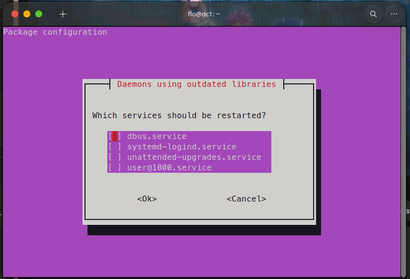
<!-- 📸 Mettre ici : "Capture d'écran du 2026-07-04 15-31-17 1.png" -->

---

### Étape 3 — Installer les paquets Samba/Kerberos

```bash
sudo apt install samba smbclient winbind krb5-user dnsutils -y
```

Pendant l'installation, `krb5-user` pose trois questions :
- **Default Kerberos realm** → `ADLAB.LOCAL`
- **Kerberos servers for your realm** → `dc1`
- **Administrative server for your realm** → `dc1`

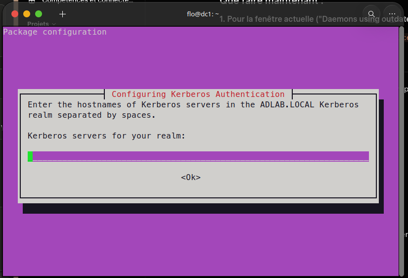
<!-- 📸 Mettre ici : "Capture d'écran du 2026-07-04 15-33-35.png" -->

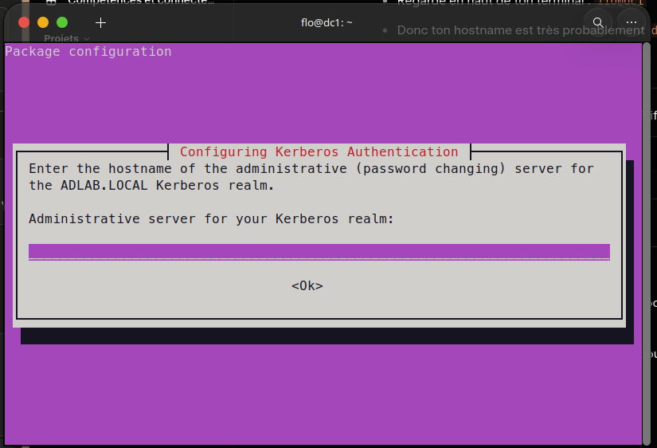
<!-- 📸 Mettre ici : "Capture d'écran du 2026-07-04 15-34-26.png" -->

On stoppe et désactive les services Samba classiques — ils seront remplacés par le service unifié `samba-ad-dc` :

```bash
# 1. Arrêter les services immédiatement
sudo systemctl stop smbd nmbd winbind

# 2. Empêcher ces services de redémarrer au prochain boot
sudo systemctl disable smbd nmbd winbind

# 3. Masquer les services (protection supplémentaire)
sudo systemctl mask smbd nmbd winbind
```

On renomme la configuration par défaut — la provision va en générer une nouvelle :

```bash
sudo mv /etc/samba/smb.conf /etc/samba/smb.conf.orig
```

---

### Étape 4 — Provisionner le domaine AD avec samba-tool

```bash
sudo samba-tool domain provision --use-rfc2307 --interactive
```

Répondre aux questions suivantes :

```
Realm              : ADLAB.LOCAL
Domain             : ADLAB
Server Role        : dc
DNS backend        : SAMBA_INTERNAL
DNS forwarder IP   : 8.8.8.8
Administrator password : (mot de passe complexe)
```

À la fin, `samba-tool` affiche les infos du domaine (realm, domaine, SID) — les garder précieusement.

> **💡 À quoi sert le DNS forwarder ?**
> Samba devient le serveur DNS du domaine `ADLAB.LOCAL` mais ne connaît pas internet.
> Le forwarder (`8.8.8.8`) lui permet de transférer les requêtes internet qu'il ne connaît pas vers Google DNS.
> Sans forwarder, les machines du domaine ne peuvent pas accéder à internet.

---

### Étape 5 — Configurer Kerberos avec le fichier généré

```bash
sudo cp /var/lib/samba/private/krb5.conf /etc/krb5.conf
```

La provision a créé un fichier Kerberos dans `/var/lib/samba/private/krb5.conf` mais Ubuntu cherche ce fichier dans `/etc/krb5.conf`. Cette commande copie le fichier au bon emplacement.

---

### Étape 6 — Basculer le DNS du serveur sur lui-même

Samba fait maintenant office de serveur DNS. Il faut désactiver le stub resolver de `systemd-resolved` et faire pointer le serveur sur lui-même :

```bash
sudo nano /etc/systemd/resolved.conf
```

Ajouter à la fin du fichier :

```ini
[Resolve]
DNSStubListener=no
```

Sauvegarder (`Ctrl+O` → `Entrée`) puis quitter (`Ctrl+X`), et appliquer :

```bash
sudo systemctl restart systemd-resolved
sudo rm /etc/resolv.conf
echo "nameserver 127.0.0.1" | sudo tee /etc/resolv.conf
```

Vérifier qu'aucun service n'occupe déjà le port 53 :

```bash
sudo ss -tulpn | grep :53
```

---

### Étape 7 — Démarrer le service samba-ad-dc

```bash
sudo systemctl unmask samba-ad-dc
sudo systemctl enable --now samba-ad-dc
sudo systemctl status samba-ad-dc
```

---

### Étape 8 — Vérifications

```bash
smbclient -L localhost -U%
samba-tool domain level show
host -t SRV _ldap._tcp.adlab.local
host -t SRV _kerberos._udp.adlab.local
kinit administrator@ADLAB.LOCAL
klist
```

Si `kinit` retourne un ticket sans erreur, le DC est opérationnel ✅

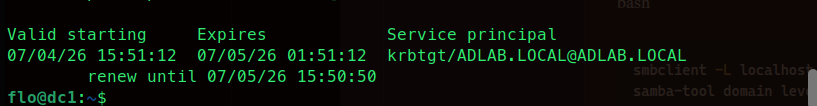
<!-- 📸 Mettre ici : "Pasted image 20260704163415.png" -->

---

### Étape 9 — Créer utilisateurs, groupes et OU avec samba-tool

```bash
# Créer une unité d'organisation
sudo samba-tool ou create "OU=Etudiants,DC=adlab,DC=local"

# Créer un utilisateur
sudo samba-tool user create florentin --userou="OU=Etudiants" --given-name="Florentin" --surname="X"

# Créer un groupe
sudo samba-tool group add informatique

# Ajouter l'utilisateur au groupe
sudo samba-tool group addmembers informatique florentin

# Lister les utilisateurs
sudo samba-tool user list
```

---

### Étape 10 — Joindre la VM Ubuntu Desktop au domaine

**1. Configurer le DNS vers le DC**

Configurer le DNS pour pointer uniquement vers le DC (`192.168.34.138`) — sinon la résolution du domaine échoue.

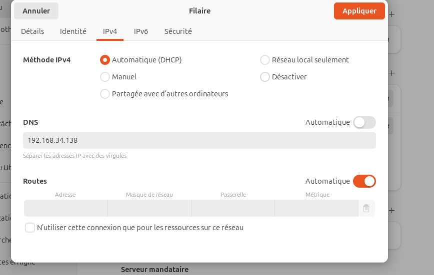
<!-- 📸 Mettre ici : "Pasted image 20260708193457.png" -->

> **⚠️ Problème rencontré :** Même avec le DNS défini, l'Ubuntu Desktop interrogeait toujours `127.0.0.53`. Ce problème était dû au service `systemd-resolved` qui écrasait la configuration statique en privilégiant les serveurs DNS poussés par le bail DHCP de VMware, rendant le contrôleur de domaine `adlab.local` introuvable.
>
> **✅ Solution :** Désactivation complète de `systemd-resolved` et configuration d'un fichier `/etc/resolv.conf` pointant directement sur l'IP du DC.

```bash
# 1.1 Neutraliser le résolveur local
sudo systemctl stop systemd-resolved
sudo systemctl disable systemd-resolved

# 1.2 Supprimer le lien dynamique et créer le fichier fixe
sudo rm -f /etc/resolv.conf
echo "nameserver 192.168.34.138" | sudo tee /etc/resolv.conf
```

**2. Synchroniser l'heure**

```bash
sudo apt install chrony -y
sudo systemctl enable --now chrony
```

**3. Installer les paquets nécessaires**

```bash
sudo apt install realmd sssd sssd-tools libnss-sss libpam-sss adcli samba-common-bin oddjob oddjob-mkhomedir packagekit -y
```

**4. Découvrir le domaine**

```bash
sudo realm discover ADLAB.LOCAL
```

**5. Rejoindre le domaine**

```bash
sudo realm join -U administrator ADLAB.LOCAL
```

**6. Activer la création automatique des répertoires home**

```bash
sudo pam-auth-update --enable mkhomedir
```

**7. Tester la connexion avec un compte du domaine**

Se connecter avec `florentin@adlab.local` :

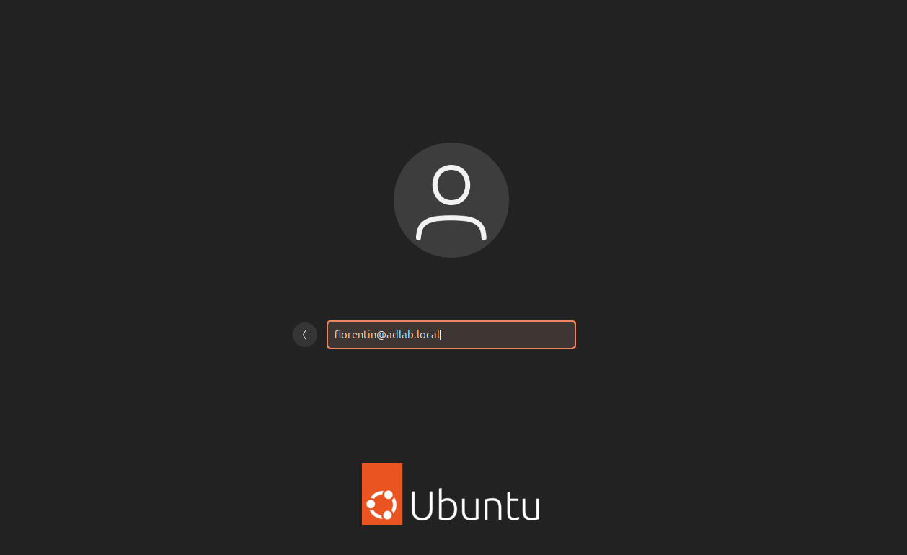
<!-- 📸 Mettre ici : "Capture d'écran du 2026-07-08 19-51-49.png" -->

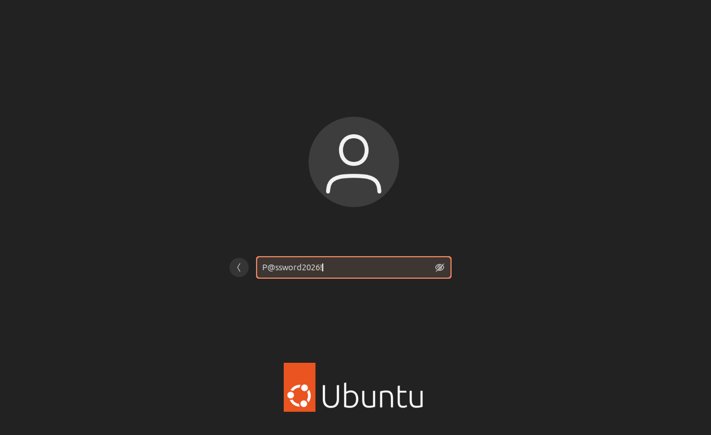
<!-- 📸 Mettre ici : "Capture d'écran du 2026-07-08 19-52-31.png" -->

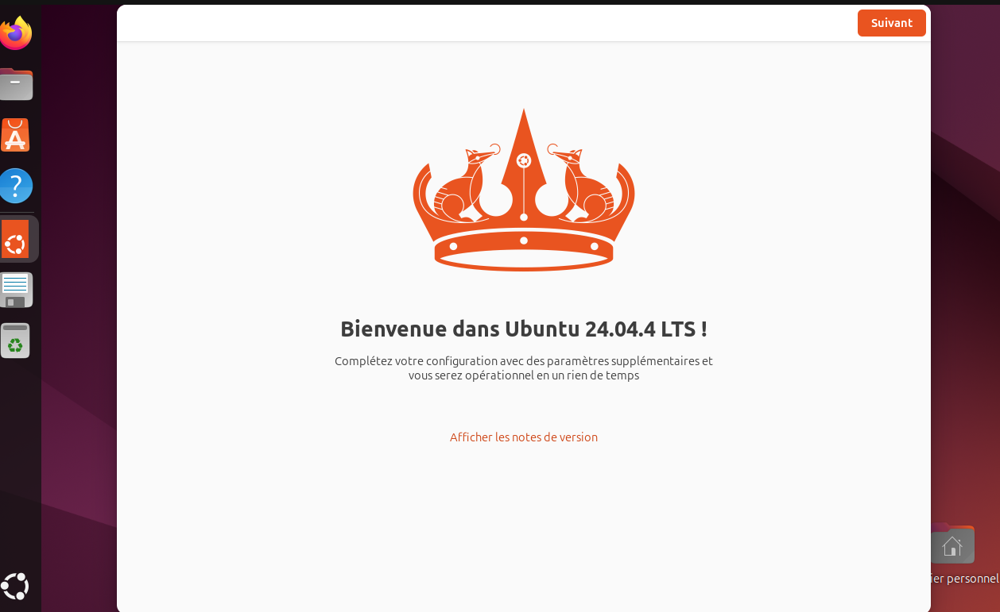
<!-- 📸 Mettre ici : "Capture d'écran du 2026-07-08 19-52-40.png" -->

---

### Étape 11 — Joindre la VM Windows 10 au domaine

**1.** Configurer la carte réseau : DNS préféré = `192.168.34.138`

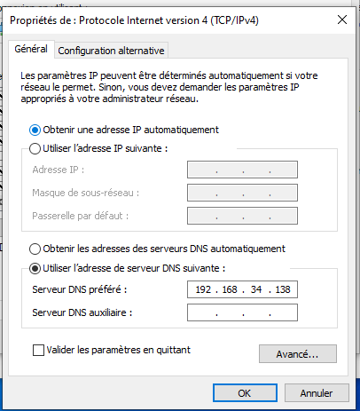
<!-- 📸 Mettre ici : "Capture d'écran du 2026-07-09 15-09-58.png" -->

**2.** Vérifier que l'heure est synchronisée avec le DC.

**3.** Aller dans **Paramètres > Système > Informations système > Renommer ce PC (avancé)**, onglet **Nom de l'ordinateur** → **Modifier** → sélectionner **Domaine** → taper `adlab.local`.

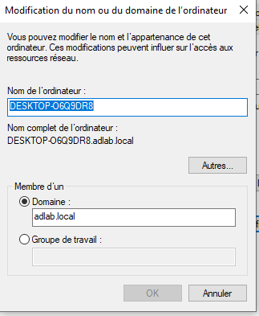
<!-- 📸 Mettre ici : "Capture d'écran du 2026-07-09 15-10-39.png" -->

**4.** Windows demande les identifiants : utiliser `administrator` avec le mot de passe défini lors de la provision.

**5.** Redémarrer la machine.

**6.** Se connecter avec `ADLAB\administrator` ou avec le compte `florentin` créé via samba-tool.

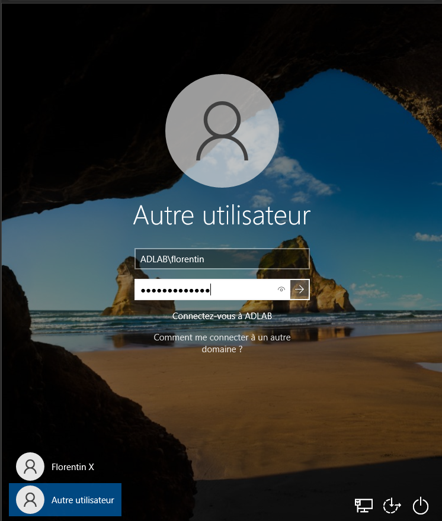
<!-- 📸 Mettre ici : "Capture d'écran du 2026-07-09 18-55-15.png" -->

---

### Étape 12 — Partage de fichiers depuis le DC

**1. Créer le dossier à partager**

```bash
sudo mkdir -p /srv/partage
sudo chmod 777 /srv/partage

# Créer un fichier de test
sudo touch /srv/partage/test.txt
echo "Fichier créé depuis le DC !" | sudo tee /srv/partage/test.txt
```

**2. Ajouter le partage dans smb.conf**

```bash
sudo nano /etc/samba/smb.conf
```

Ajouter à la fin du fichier :

```ini
[Partage]
   path = /srv/partage
   read only = no
   browseable = yes
   valid users = @"ADLAB\Domain Users"
```

> `read only = no` → les utilisateurs peuvent lire ET écrire  
> `browseable = yes` → le partage est visible dans l'explorateur

**3. Redémarrer Samba**

```bash
sudo systemctl restart samba-ad-dc
```

**4. Test depuis Windows 10**

Dans l'explorateur de fichiers, taper dans la barre d'adresse :

```
\\dc1\Partage
```

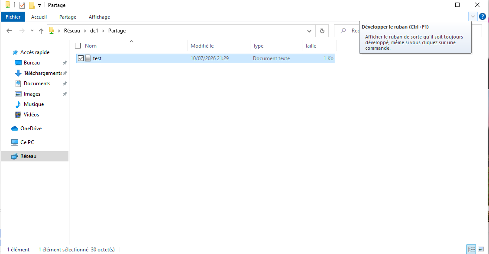
<!-- 📸 Mettre ici : "Capture d'écran du 2026-07-10 21-30-20.png" -->

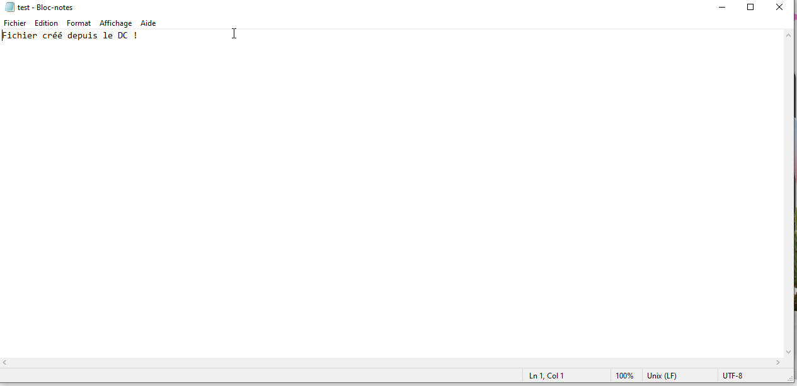
<!-- 📸 Mettre ici : "Capture d'écran du 2026-07-10 21-30-33.png" -->

**5. Test depuis Ubuntu Desktop**

`smbclient` permet un accès temporaire au dossier partagé et la possibilité de télécharger des fichiers :

```bash
smbclient //192.168.34.138/Partage -U florentin@ADLAB.LOCAL
```

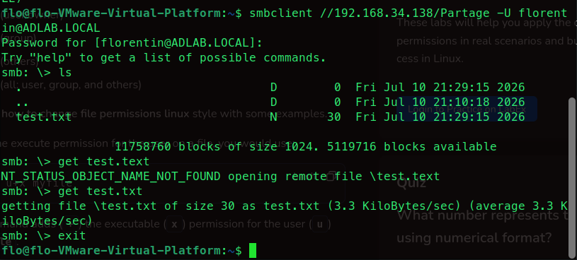
<!-- 📸 Mettre ici : "Capture d'écran du 2026-07-10 21-43-05.png" -->

Le fichier téléchargé est accessible dans le gestionnaire de fichiers :

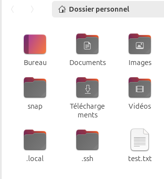
<!-- 📸 Mettre ici : "Capture d'écran du 2026-07-10 21-44-25.png" -->

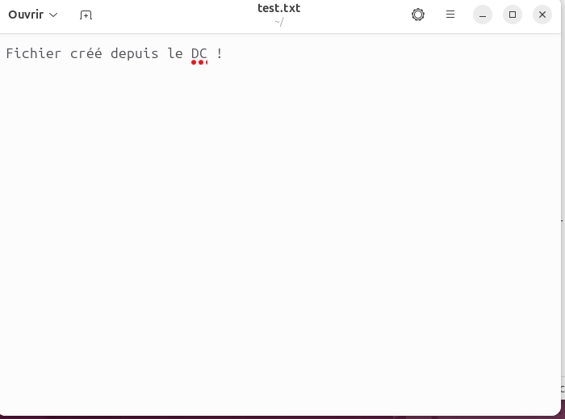
<!-- 📸 Mettre ici : "Capture d'écran du 2026-07-10 21-44-38.png" -->

---

### Étape 13 — Déploiement d'Ansible

Ansible est un outil qui permet d'automatiser la configuration de plusieurs machines en même temps via des fichiers texte simples, sans installer quoi que ce soit sur les machines cibles.

**1. Installer Ansible sur le DC**

```bash
sudo apt install python3-pip -y
pip3 install ansible
export PATH=$PATH:~/.local/bin
```

**2. Créer un dossier de travail**

```bash
mkdir ~/ansible-lab && cd ~/ansible-lab
```

**3. Créer le fichier d'inventaire**

C'est le fichier qui contient la liste des machines qu'Ansible va gérer :

```bash
nano inventaire.ini
```

```ini
[clients_linux]
ubuntu-desktop ansible_host=192.168.34.133 ansible_user=flo
```

**4. Ping Ansible — vérifier que la machine répond**

```bash
ansible -i inventaire.ini clients_linux -m ping --ask-pass
```

Si tout fonctionne :

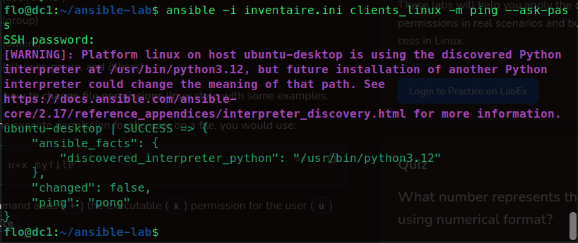
<!-- 📸 Mettre ici : "Capture d'écran du 2026-07-10 22-19-42.png" -->

**5. Premier playbook**

Créer le fichier `test.yml` :

```bash
nano test.yml
```

```yaml
---
- name: Mon premier playbook
  hosts: clients_linux
  become: yes          # = sudo

  tasks:
    - name: Vérifier que curl est installé
      apt:
        name: curl
        state: present

    - name: Créer un fichier de test
      file:
        path: /tmp/ansible_test.txt
        state: touch

    - name: Écrire dedans
      copy:
        content: "Déployé par Ansible depuis le DC !\n"
        dest: /tmp/ansible_test.txt
```

Lancer le playbook :

```bash
ansible-playbook -i inventaire.ini test.yml --ask-pass --ask-become-pass
```

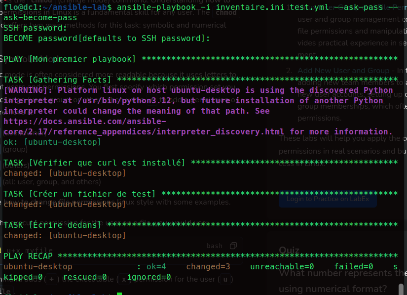
<!-- 📸 Mettre ici : "Capture d'écran du 2026-07-10 22-25-24 1.png" -->

Vérification du résultat sur la machine Ubuntu Desktop :

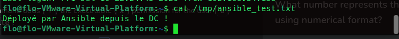
<!-- 📸 Mettre ici : "Capture d'écran du 2026-07-10 22-26-58.png" -->

---

## ⚠️ Problèmes rencontrés et solutions

| Problème | Cause | Solution |
|----------|-------|----------|
| DNS ignoré sur Ubuntu Desktop | `systemd-resolved` écrasait la config DHCP | Désactivation de `systemd-resolved` + `/etc/resolv.conf` fixe |
| `sshpass` manquant pour Ansible | Non installé par défaut | `sudo apt install sshpass -y` |
| Module Python manquant sur le client | Conflit de versions Ansible | Désinstaller Ansible du client + `python3-six` |
| Ansible introuvable après install pip | PATH non mis à jour | `export PATH=$PATH:~/.local/bin` |

---


